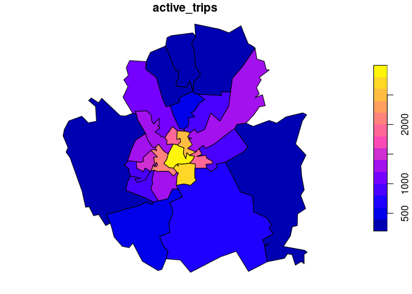
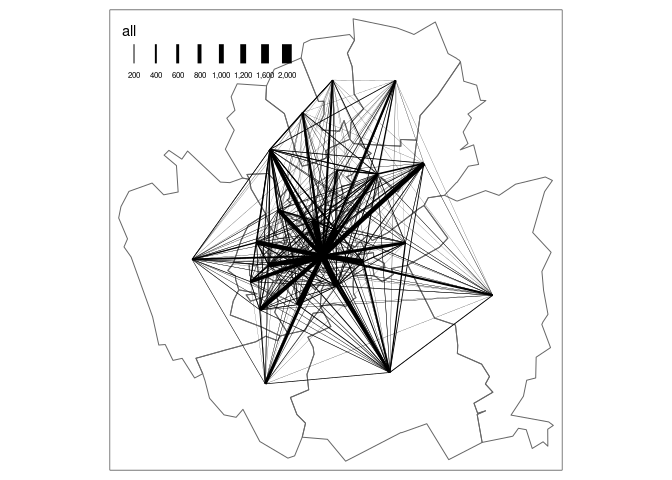

The aim of this repo is to showcase ways of generating evidence to
support strategic active network planning tools in England and beyond.

What follows is a language agnostic but fully reproducible (with R, see
README.qmd for code) description of input datasets, processes and
functions for generating estimates of active travel uptake down to the
street level. It will make use of some of the same input datasets that
are used in the Propensity to Cycle Tool (PCT). For full
reproducibility, the code in this repo is developed in a Docker
container using the
[.devcontainer.json](https://containers.dev/implementors/json_reference/)
format.

We will cover input datasets, processing steps, and outputs.

# Input datasets

The input datasets were extracted from the Propensity to Cycle Tool and
underlying datasets. Small input datasets are saved in the `input/`
folder of this repo.

## Zone data

Zone data is available at many geographic levels, including large zones
(e.g. MSOAs) and small zones (e.g. Output Areas). MSOAs representing
York are shown below.

## Origin destination data

OD data has the following structure:

| geo_code1 | geo_code2 | all | from_home | light_rail | train | bus | taxi | motorbike | car_driver | car_passenger | bicycle | foot | other | geo_name1 | geo_name2 | la_1 | la_2 |
|:----------|:----------|----:|----------:|-----------:|------:|----:|-----:|----------:|-----------:|--------------:|--------:|-----:|------:|:----------|:----------|:-----|:-----|
| E02002772 | E02002772 | 365 |         0 |          0 |     2 |   8 |    0 |         2 |        147 |            14 |      41 |  150 |     1 | York 001  | York 001  | York | York |
| E02002772 | E02002773 |  27 |         0 |          0 |     0 |   1 |    0 |         0 |         20 |             1 |       2 |    2 |     1 | York 001  | York 002  | York | York |
| E02002772 | E02002774 |  18 |         0 |          0 |     1 |   0 |    0 |         0 |         15 |             2 |       0 |    0 |     0 | York 001  | York 003  | York | York |
| E02002772 | E02002775 |  69 |         0 |          0 |     0 |   9 |    0 |         1 |         51 |             4 |       4 |    0 |     0 | York 001  | York 004  | York | York |
| E02002772 | E02002776 | 253 |         0 |          0 |     1 |  32 |    0 |         7 |        162 |            28 |      20 |    3 |     0 | York 001  | York 005  | York | York |
| E02002772 | E02002777 | 165 |         0 |          0 |     0 |  10 |    0 |         0 |        136 |            11 |       8 |    0 |     0 | York 001  | York 006  | York | York |
| E02002772 | E02002778 |  50 |         0 |          0 |     0 |   2 |    0 |         0 |         41 |             3 |       4 |    0 |     0 | York 001  | York 007  | York | York |
| E02002772 | E02002779 |  42 |         0 |          0 |     0 |   0 |    0 |         0 |         39 |             1 |       1 |    1 |     0 | York 001  | York 008  | York | York |
| E02002772 | E02002780 | 122 |         0 |          0 |     0 |  10 |    0 |         4 |         86 |             9 |      11 |    2 |     0 | York 001  | York 009  | York | York |
| E02002772 | E02002781 | 124 |         0 |          0 |     0 |  10 |    2 |         4 |         89 |             6 |      13 |    0 |     0 | York 001  | York 010  | York | York |

This dataset was extracted from the following open access endpoint:
https://s3-eu-west-1.amazonaws.com/statistics.digitalresources.jisc.ac.uk/dkan/files/FLOW/wu03ew_v2/wu03ew_v2.zip

The OD dataset can be visualised in a more policy-relevant way as
follows (see `output/desire_lines.geojson`):

Clearly this is an oversimplification. The section on ‘jittering’
demonstrates how disaggregation and setting weighted random start and
end points can lead to more realistic desire lines and route networks.

## Data on origins and destinations

A key dataset type for simulating trips not covered by available OD data
is data on trip origins (e.g. representing residential areas and
population estimates) and ‘trip attractors’. These can be obtained from
OSM. These datasets typically have pont and polygon geometries and
numerous features that can feed into trip generation models, a
subsection of the enxt section.

There are currently datasets representing origins and destinations in
this repo, something that may change in the future.

# Processing steps

## Desire line generation

## Trip generation

## Jittering

## Routing

## Update functions

## Route network generation

## Visualisation

# Outputs
